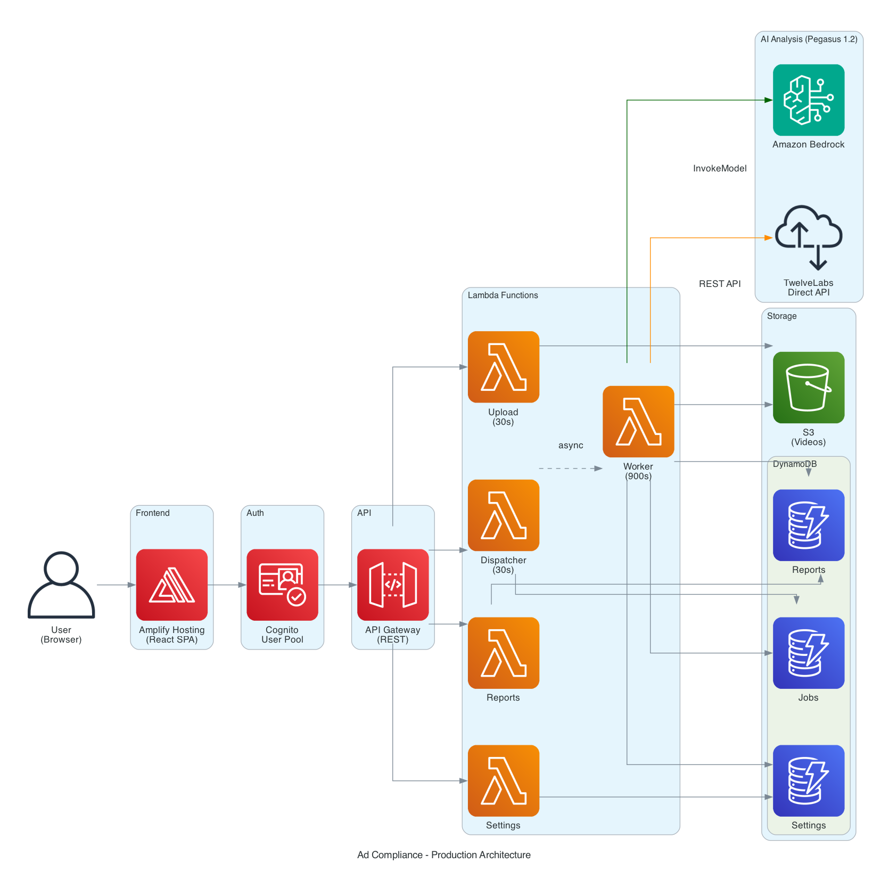

# Application Architecture

> Ad Compliance & Brand Safety 시스템 아키텍처 문서
> Streamlit 로컬 앱과 AWS Amplify 프로덕션 앱 구성

---

## Table of Contents

1. [시스템 개요](#1-시스템-개요)
2. [아키텍처 구성](#2-아키텍처-구성)
3. [Streamlit 로컬 앱](#3-streamlit-로컬-앱)
4. [AWS Amplify 프로덕션 앱](#4-aws-amplify-프로덕션-앱)
5. [CDK 인프라 스택](#5-cdk-인프라-스택)
6. [Lambda 함수 구조](#6-lambda-함수-구조)
7. [데이터 흐름](#7-데이터-흐름)
8. [보안 설계](#8-보안-설계)

---

## TL;DR

- **What**: 비디오 광고 컴플라이언스 분석 시스템 (TwelveLabs/Bedrock AI 기반)
- **Why**: 광고 콘텐츠의 정책 위반 자동 탐지 및 3축 평가 (Compliance/Product/Disclosure)
- **How**: Streamlit(로컬 데모) + React/Amplify(프로덕션) 이중 아키텍처
- **Key**: Dispatcher/Worker 비동기 패턴으로 최대 15분 분석 지원, Cognito 인증 필수

---

## 1. 시스템 개요

본 시스템은 비디오 광고의 컴플라이언스 위반을 AI로 분석하는 애플리케이션입니다. 두 가지 배포 형태를 지원합니다:

| 구분 | Streamlit 로컬 앱 | AWS Amplify 프로덕션 앱 |
| --- | --- | --- |
| 용도 | 로컬 개발/데모 | 프로덕션 배포 |
| 인증 | 없음 (로컬 전용) | Cognito User Pool |
| 백엔드 | 직접 API 호출 | API Gateway + Lambda |
| 스토리지 | 로컬 파일시스템 | S3 + DynamoDB |
| 분석 시간 | 동기 (최대 5분) | 비동기 (최대 15분) |

---

## 2. 아키텍처 구성

### 2.1 프로덕션 아키텍처 다이어그램



### 2.2 전체 시스템 다이어그램

```text
┌─────────────────────────────────────────────────────────────────────────────┐
│                           Ad Compliance System                               │
├─────────────────────────────────┬───────────────────────────────────────────┤
│     Streamlit Local App         │        AWS Amplify Production App          │
│                                 │                                            │
│  ┌─────────────┐               │  ┌─────────────┐    ┌──────────────────┐  │
│  │ dashboard.py│               │  │ React SPA   │───>│ Cognito Auth     │  │
│  │ (Streamlit) │               │  │ (Vite+MUI)  │    │ (User Pool)      │  │
│  └──────┬──────┘               │  └──────┬──────┘    └──────────────────┘  │
│         │                       │         │                                  │
│         ▼                       │         ▼                                  │
│  ┌─────────────┐               │  ┌─────────────┐                           │
│  │ core/       │               │  │ API Gateway │                           │
│  │ - bedrock   │               │  │ (REST API)  │                           │
│  │ - twelvelabs│               │  └──────┬──────┘                           │
│  └─────────────┘               │         │                                  │
│                                 │         ▼                                  │
│                                 │  ┌─────────────────────────────────────┐  │
│                                 │  │           Lambda Functions           │  │
│                                 │  │  ┌────────┐ ┌──────────┐ ┌────────┐ │  │
│                                 │  │  │Upload  │ │Dispatcher│ │Worker  │ │  │
│                                 │  │  │(30s)   │ │(30s)     │ │(900s)  │ │  │
│                                 │  │  └────────┘ └──────────┘ └────────┘ │  │
│                                 │  │  ┌────────┐ ┌──────────┐            │  │
│                                 │  │  │Reports │ │Settings  │            │  │
│                                 │  │  └────────┘ └──────────┘            │  │
│                                 │  └─────────────────────────────────────┘  │
│                                 │         │                                  │
│                                 │         ▼                                  │
│                                 │  ┌─────────────────────────────────────┐  │
│                                 │  │           AWS Services               │  │
│                                 │  │  ┌────────┐ ┌──────────┐ ┌────────┐ │  │
│                                 │  │  │S3      │ │DynamoDB  │ │Bedrock │ │  │
│                                 │  │  │(Videos)│ │(3 Tables)│ │(AI)    │ │  │
│                                 │  │  └────────┘ └──────────┘ └────────┘ │  │
│                                 │  └─────────────────────────────────────┘  │
└─────────────────────────────────┴───────────────────────────────────────────┘
```

### 2.2 프로젝트 디렉토리 구조

```text
ad-compliance/
├── app/
│   └── dashboard.py              # Streamlit 로컬 앱
├── core/                         # 공유 분석 모듈
│   ├── bedrock_client.py         # Bedrock API 클라이언트
│   ├── bedrock_analyzer.py       # Bedrock 응답 파서
│   ├── twelvelabs_client.py      # TwelveLabs API 클라이언트
│   ├── decision.py               # 3축 평가 엔진
│   └── evidence_extractor.py     # 증거 추출 (ffmpeg)
├── deployment/
│   ├── cdk/                      # AWS CDK 인프라
│   │   ├── bin/app.ts            # CDK 앱 진입점
│   │   └── lib/
│   │       ├── auth-stack.ts     # Cognito User Pool
│   │       ├── storage-stack.ts  # S3 + DynamoDB
│   │       ├── api-stack.ts      # API Gateway + Lambda
│   │       └── frontend-stack.ts # Amplify Hosting
│   ├── frontend/                 # React SPA
│   │   └── src/
│   │       ├── App.tsx           # 메인 앱 (Authenticator)
│   │       ├── pages/            # 페이지 컴포넌트
│   │       └── services/api.ts   # API 클라이언트
│   └── lambda/                   # Lambda 핸들러
│       ├── analyze/
│       │   ├── dispatcher.py     # 비동기 작업 생성
│       │   └── worker.py         # 실제 분석 수행
│       ├── upload/handler.py     # S3 presigned URL
│       ├── reports/handler.py    # 분석 결과 조회
│       └── settings/handler.py   # 사용자 설정
├── prompts/                      # AI 프롬프트 템플릿
└── shared/                       # 공유 상수/스키마
```

---

## 3. Streamlit 로컬 앱

### 3.1 개요

`app/dashboard.py`는 로컬 개발 및 데모용 Streamlit 애플리케이션입니다.

```bash
streamlit run app/dashboard.py
```

### 3.2 페이지 구성

| 페이지 | 기능 |
| --- | --- |
| Upload & Analyze | 비디오 업로드 및 실시간 분석 |
| Analysis History | 이전 분석 결과 조회 |
| Settings | 백엔드 선택 (TwelveLabs/Bedrock) 및 API 키 설정 |

### 3.3 분석 파이프라인

```text
1. 비디오 업로드 (mp4/mov/avi/mkv)
2. ffmpeg H.264 트랜스코딩
3. TwelveLabs 또는 Bedrock API 호출
4. 응답 파싱 → 3축 평가
5. BLOCK 판정 시 증거 추출 (썸네일/클립)
6. 결과 표시 및 JSON 저장
```

### 3.4 제한사항

- 동기 처리로 인해 분석 시간 제한 (약 5분)
- 인증 없음 (로컬 전용)
- 결과는 로컬 파일시스템에 저장

---

## 4. AWS Amplify 프로덕션 앱

### 4.1 개요

`deployment/frontend/`는 AWS Amplify로 배포되는 React SPA입니다.

- React 18 + TypeScript
- Material-UI (MUI) 컴포넌트
- AWS Amplify Authenticator (Cognito 인증)
- Vite 빌드 시스템

### 4.2 페이지 구성

| 경로 | 컴포넌트 | 기능 |
| --- | --- | --- |
| `/analyze` | AnalyzePage | 비디오 업로드 및 분석 |
| `/history` | HistoryPage | 분석 이력 조회 |
| `/settings` | SettingsPage | 백엔드 설정 |

### 4.3 인증 흐름

```text
1. 사용자 → Cognito 로그인 (Amplify Authenticator)
2. ID Token 발급
3. API 요청 시 Authorization 헤더에 토큰 포함
4. API Gateway → Cognito Authorizer 검증
5. Lambda 실행 (JWT claims에서 user_id 추출)
```

### 4.4 API 클라이언트 (`services/api.ts`)

주요 함수:

| 함수 | 엔드포인트 | 설명 |
| --- | --- | --- |
| `getUploadUrl()` | POST /upload-url | S3 presigned URL 생성 |
| `submitAnalysis()` | POST /analyze | 분석 작업 생성 |
| `getJobStatus()` | GET /analyze/{jobId} | 작업 상태 조회 |
| `analyzeVideo()` | - | 폴링 기반 분석 완료 대기 |
| `listReports()` | GET /reports | 분석 이력 조회 |
| `getSettings()` | GET /settings | 사용자 설정 조회 |
| `saveSettings()` | PUT /settings | 사용자 설정 저장 |

---

## 5. CDK 인프라 스택

### 5.1 스택 구성

```text
AdCompliance-{env}-Auth      → Cognito User Pool
AdCompliance-{env}-Storage   → S3 Bucket + DynamoDB Tables
AdCompliance-{env}-Api       → API Gateway + Lambda Functions
AdCompliance-{env}-Frontend  → Amplify Hosting
```

### 5.2 AuthStack (`auth-stack.ts`)

Cognito User Pool 생성:

- `selfSignUpEnabled: false` (관리자만 사용자 생성 가능)
- 이메일 기반 로그인
- MFA 선택적 활성화 (TOTP)
- 비밀번호 정책: 8자 이상, 대소문자/숫자/특수문자 필수

### 5.3 StorageStack (`storage-stack.ts`)

S3 버킷:

- `blockPublicAccess: BLOCK_ALL` (퍼블릭 액세스 완전 차단)
- SSE-S3 암호화
- uploads/ 폴더 30일 자동 만료
- Bedrock 서비스 읽기 권한 (리소스 정책)

DynamoDB 테이블:

| 테이블 | PK | SK | 용도 |
| --- | --- | --- | --- |
| reports | user_id | analyzed_at | 분석 결과 저장 |
| settings | user_id | - | 사용자 설정 |
| jobs | job_id | - | 비동기 작업 상태 |

### 5.4 ApiStack (`api-stack.ts`)

API Gateway REST API:

- Cognito Authorizer 적용
- CORS 전체 허용 (개발 편의)
- 4XX/5XX 응답에도 CORS 헤더 포함

Lambda 함수:

| 함수 | Timeout | Memory | 역할 |
| --- | --- | --- | --- |
| Upload | 30s | 128MB | S3 presigned URL 생성 |
| Dispatcher | 30s | 128MB | 비동기 작업 생성 |
| Worker | 900s | 1024MB | 실제 분석 수행 |
| Reports | 30s | 128MB | 분석 결과 조회 |
| Settings | 30s | 128MB | 사용자 설정 관리 |

### 5.5 FrontendStack (`frontend-stack.ts`)

Amplify Hosting:

- GitHub 연동 자동 빌드
- 환경 변수 주입 (API URL, Cognito 설정)
- SPA 라우팅 지원 (모든 경로 → index.html)

---

## 6. Lambda 함수 구조

### 6.1 Dispatcher/Worker 비동기 패턴

API Gateway의 30초 타임아웃 제한을 우회하기 위해 비동기 패턴을 사용합니다:

```text
┌──────────┐    POST /analyze    ┌────────────┐
│  Client  │ ─────────────────> │ Dispatcher │
│          │ <───────────────── │  (30s)     │
│          │   202 {jobId}      └─────┬──────┘
│          │                          │ Lambda.invoke
│          │                          │ (Event/Async)
│          │                          ▼
│          │                    ┌────────────┐
│          │                    │   Worker   │
│          │                    │  (900s)    │
│          │                    └─────┬──────┘
│          │                          │
│          │   GET /analyze/{jobId}   │
│          │ ─────────────────────────┤
│          │ <────────────────────────┤
│          │   {status, result}       │
└──────────┘                          ▼
                               ┌────────────┐
                               │  DynamoDB  │
                               │   (Jobs)   │
                               └────────────┘
```

### 6.2 Dispatcher (`dispatcher.py`)

POST /analyze 처리:

1. JWT에서 user_id 추출
2. 요청 검증 (s3Key, region)
3. job_id 생성 (UUID v4)
4. Jobs 테이블에 PENDING 상태 저장
5. Worker Lambda 비동기 호출
6. HTTP 202 + jobId 반환

GET /analyze/{jobId} 처리:

1. Jobs 테이블에서 작업 조회
2. user_id 일치 확인 (보안)
3. 상태에 따라 result 또는 error 반환

### 6.3 Worker (`worker.py`)

비동기 분석 수행:

1. Jobs 상태 → PROCESSING
2. Settings 테이블에서 백엔드 설정 조회
3. S3에서 비디오 다운로드
4. ffmpeg 전처리 (썸네일 스트림 제거)
5. Bedrock 또는 TwelveLabs 분석
6. description_audit 후처리
7. 3축 평가 (make_split_decision)
8. Reports 테이블에 결과 저장
9. Jobs 상태 → COMPLETED + result

### 6.4 Upload (`upload/handler.py`)

S3 presigned URL 생성:

- 파일 확장자 검증 (mp4, mov, avi, mkv)
- 파일 크기 제한 (25MB)
- S3 키 형식: `uploads/{user_id}/{timestamp}_{filename}`
- URL 유효 시간: 15분

---

## 7. 데이터 흐름

### 7.1 비디오 분석 전체 흐름

```text
┌─────────┐                                                    
│ Browser │                                                    
└────┬────┘                                                    
     │ 1. POST /upload-url                                     
     ▼                                                         
┌─────────┐  presigned URL  ┌─────────┐                       
│   API   │ ──────────────> │ Upload  │                       
│ Gateway │                 │ Lambda  │                       
└────┬────┘                 └─────────┘                       
     │                                                         
     │ 2. PUT (presigned URL)                                  
     ▼                                                         
┌─────────┐                                                    
│   S3    │ uploads/{user_id}/{timestamp}_{filename}          
│ Bucket  │                                                    
└────┬────┘                                                    
     │                                                         
     │ 3. POST /analyze {s3Key, region}                        
     ▼                                                         
┌─────────┐  async invoke   ┌─────────┐                       
│Dispatch │ ──────────────> │ Worker  │                       
│ Lambda  │                 │ Lambda  │                       
└────┬────┘                 └────┬────┘                       
     │                           │                             
     │ 4. 202 {jobId}            │ 5. Download from S3         
     ▼                           │ 6. Bedrock/TwelveLabs       
┌─────────┐                      │ 7. Save to Reports          
│ Browser │                      │ 8. Update Jobs              
│ (Poll)  │                      ▼                             
└────┬────┘                 ┌─────────┐                       
     │                      │DynamoDB │                       
     │ 9. GET /analyze/{id} │ (Jobs)  │                       
     ▼                      └─────────┘                       
┌─────────┐                                                    
│   API   │ ──> Dispatcher ──> Jobs Table ──> {status, result}
│ Gateway │                                                    
└─────────┘                                                    
```

### 7.2 DynamoDB 테이블 스키마

Jobs 테이블:

```json
{
  "job_id": "uuid",
  "user_id": "cognito-sub",
  "s3_key": "uploads/...",
  "region": "global",
  "status": "PENDING|PROCESSING|COMPLETED|FAILED",
  "created_at": "ISO8601",
  "updated_at": "ISO8601",
  "result": { ... },
  "error": "error message",
  "ttl": 1234567890
}
```

Reports 테이블:

```json
{
  "user_id": "cognito-sub",
  "analyzed_at": "ISO8601",
  "video_id": "uuid",
  "video_file": "filename.mp4",
  "region": "global",
  "decision": "APPROVE|REVIEW|BLOCK",
  "decision_reasoning": "...",
  "compliance": { "status": "...", "reasoning": "..." },
  "product": { "status": "...", "reasoning": "..." },
  "disclosure": { "status": "...", "reasoning": "..." },
  "campaign_relevance": { ... },
  "policy_violations": [ ... ]
}
```

---

## 8. 보안 설계

### 8.1 인증/인가

- Cognito User Pool: 자가 가입 비활성화 (`selfSignUpEnabled: false`)
- API Gateway: Cognito Authorizer로 모든 엔드포인트 보호
- Lambda: JWT claims에서 user_id 추출하여 데이터 격리

### 8.2 데이터 보호

- S3: 퍼블릭 액세스 완전 차단 (`BLOCK_ALL`)
- S3: SSE-S3 서버 측 암호화
- DynamoDB: 암호화 기본 활성화
- API Gateway: HTTPS 전용

### 8.3 최소 권한 원칙

각 Lambda 함수는 필요한 최소 권한만 부여:

| Lambda | S3 | DynamoDB | Bedrock | Lambda |
| --- | --- | --- | --- | --- |
| Upload | PutObject | - | - | - |
| Dispatcher | - | Jobs (RW) | - | Worker (Invoke) |
| Worker | GetObject | Jobs, Reports, Settings (RW) | InvokeModel | - |
| Reports | - | Reports (R) | - | - |
| Settings | - | Settings (RW) | - | - |

